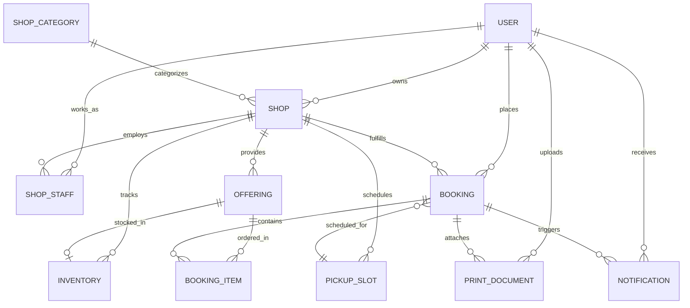

# Database Schema & Entity Relationships

Local Pickup uses **PostgreSQL** with **Prisma ORM**. The data model is generalized to support future verticals (stationery, bookstores, bakeries) while maintaining strong printing-shop semantics.

---

## Entity Relationship Diagram

---

## Core Entities Summary

### 1. `User`
- `id` (UUID, PK)
- `email` (Unique, indexed)
- `passwordHash` (Bcrypt salt rounds: 12)
- `name` (String)
- `phone` (Optional string)
- `role` (Enum: `CUSTOMER`, `SHOP_OWNER`, `SHOP_STAFF`, `ADMIN`)
- `isActive` (Boolean)

### 2. `Shop`
- `id` (UUID, PK)
- `ownerId` (FK $\rightarrow$ `User.id`)
- `categoryId` (FK $\rightarrow$ `ShopCategory.id`)
- `name`, `slug` (Unique)
- `address`, `area` (Indexed for search)
- `openingHours` (e.g. "08:00 - 20:00")
- `slotDurationMinutes` (Default: 10)
- `slotCapacity` (Default: 5 per slot)
- `status` (Enum: `PENDING`, `APPROVED`, `REJECTED`, `SUSPENDED`)

### 3. `Offering`
- `id` (UUID, PK)
- `shopId` (FK $\rightarrow$ `Shop.id`)
- `type` (Enum: `SERVICE`, `PRODUCT`)
- `name`, `description`
- `basePrice` (Float)
- `pricingConfig` (JSON string storing itemized rates: paper sizes, color surcharge, binding, lamination)
- `isActive` (Boolean)

### 4. `PickupSlot`
- `id` (UUID, PK)
- `shopId` (FK $\rightarrow$ `Shop.id`)
- `date` (DateTime truncated to start of day)
- `startTime`, `endTime` (e.g. "09:00", "09:10")
- `capacity` (Int, e.g. 5)
- `reservedCount` (Int)
- `isAvailable` (Boolean)
- Unique constraint: `[shopId, date, startTime]`

### 5. `Booking`
- `id` (UUID, PK)
- `bookingNumber` (Unique human-friendly code: `LP-XXXX`)
- `customerId` (FK $\rightarrow$ `User.id`)
- `shopId` (FK $\rightarrow$ `Shop.id`)
- `slotId` (FK $\rightarrow$ `PickupSlot.id`)
- `status` (Enum: `BOOKED`, `ACCEPTED`, `PREPARING`, `READY`, `COLLECTED`, `REJECTED`, `CANCELLED`, `EXPIRED`)
- `pickupToken` (Cryptographic high-entropy token, indexed)
- `subtotal`, `tax`, `totalPrice` (Snapshotted final values)
- `pickupTime`, `collectedAt`

### 6. `PrintDocument`
- `id` (UUID, PK)
- `bookingId` (Nullable FK $\rightarrow$ `Booking.id`)
- `customerId` (FK $\rightarrow$ `User.id`)
- `originalFileName`, `mimeType`, `fileSize`
- `storageKey` (Unique randomized file storage reference)
- `retentionHours` (Default: 24)
- `expiresAt` (Scheduled purge timestamp)
- `isDeleted` (Toggled when unlinked from disk)
